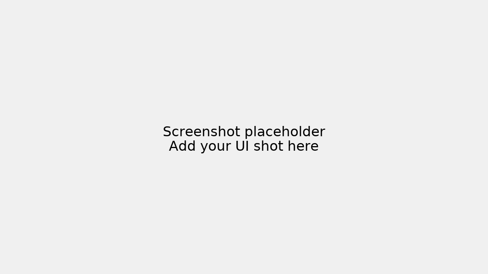

# whatsapp-summary-bot

> База репозитория (Этап M0). Публичный каркас для будущего WhatsApp-бота, который собирает сообщения из групп/чатов и делает короткие дайджесты («резюме дня/недели») с возможностью автопостинга в выбранные каналы.



## Цель
Собрать минимальную, аккуратную и безопасную основу проекта: структура папок, лицензия, .gitignore, шаблон конфигурации — без ключей и персональных данных. Это позволит быстро подключить код интеграций в следующих этапах (M1+).

## Запуск за 5 минут (smoke‑test структуры)
Пока это «нулевой» запуск: просто проверяем, что структура проекта на месте и конфиг-шаблон доступен.
```bash
# 1) Клонируйте ваш репозиторий (после создания на GitHub)
git clone https://github.com/<your-username>/whatsapp-summary-bot.git
cd whatsapp-summary-bot

# 2) (Опционально) Создайте виртуальное окружение Python
python -m venv .venv
# Windows: .venv\Scripts\activate
# macOS/Linux:
source .venv/bin/activate

# 3) Запустите проверку структуры
python examples/smoke_check.py
```

Ожидаемый результат:
```
✅ Структура ок. Найден config/config_template.yaml.
✅ .gitignore содержит правила для логов, токенов, экспортов чатов и медиа.
```
Далее — на этапах M1+ — сюда добавятся реальные зависимости и команды запуска бота.

## Ограничения
- На данном этапе **нет кода интеграции с WhatsApp API** и провайдерами (Meta Cloud API/360dialog и т. п.).
- Нет подключения LLM/серверной логики; это **только каркас**.
- Конфигурация — шаблон без значений. Реальные ключи и параметры будут добавлены позже, локально, **в файлы, которые не коммитятся**.

## Лицензия
Проект распространяется по лицензии MIT — см. файл [`LICENSE`](LICENSE).
